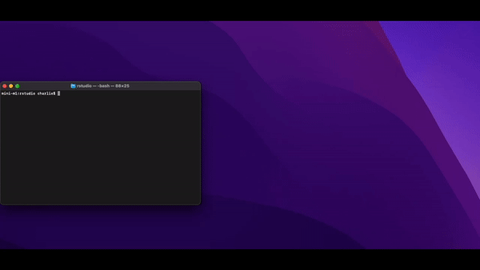
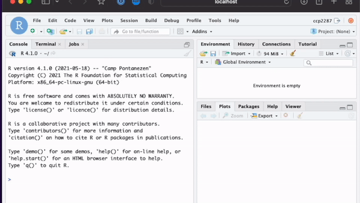

```{r setup, include=FALSE}
knitr::opts_chunk$set(echo = FALSE)
```

```{r xaringan-themer, include=FALSE, warning=FALSE}
library(xaringanthemer)
style_mono_accent(
  base_color = "#43418A",
  header_font_google = google_font("Josefin Sans"),
  text_font_google   = google_font("Montserrat", "300", "300i"),
)
```

```{r xaringanExtra-clipboard, echo=FALSE}
xaringanExtra::use_clipboard()
```

## Hoffman2 Happy Hours

Welcome to the Hoffman2 Happy Hours

Short-ish presentations on a certain topic related to HPC and Hoffman2

.pull-left[

Any thoughts on what I should do for future "Happy Hour" talks?

cpeterson@oarc.ucla.edu

]

.pull-right[


]

---

## Files for this Presentation

This presentation can be found on github under `HHH_rstudio_03_30_2022` folder

<https://github.com/ucla/hpc_workshops>

RStudio files and information for this presentation can be found also on
github under the `rstudio` folder

<https://github.com/charliecpeterson/H2_software>

---

## What is RStudio

If you are here, you most likely know what RStudio is and have used it
before.

--
.center[
.pull-left[
But why do you want to use RStudio on Hoffman2 when you can use your own computer???
]
]
--
.pull-right[
You may want to use Hoffman2 to access cluster resources, higher memory, multi-core, GPUs.

You can also access data that is already on Hoffman2.
]

--

.center[
There are two main (free) RStudio IDEs that researchers can use
]

--
.pull-left[
### RStudio Desktop

This IDE is install locally on your machine.

This is a standalone desktop application.
]

--
.pull-right[
### RStudio Server

This IDE requires a remote server to run a RStudio Server process, that
you can connect and run on a local web browser
]

---

## RStudio Server

While we do have a RStudio Desktop version on Hoffman2, this would
require X11 forwarding to display RStudio on a local machine. This can
be very slow and the interactive maybe sluggish depending on your
connection.

**RStudio Server** is the best way to use RStudio on Hoffman2

--

Hoffman2 has a container that has R/Rstudio that can be ran on with
Apptainer/Singularity

For more information on using containers, there is a Workshop [Using
Containers on HPC
resources](https://idre.ucla.edu/calendar-event/using-container-on-hpc-resources)
on Apr 20, 2022

This container is an isolate image and has it's own version of R and RStudio that is unrelated
to the versions of R that was built on Hoffman2.

<p align = "center">  </p> <p align = "center"> rstudio.com</p>

---

## Running RStudio

Steps to run RStudio on Hoffman2

### Get an interactive job
.pull-left[
You cannot run containers on login nodes. You **MUST** use a compute
node
]
.pull-right[

```{bash, eval = FALSE, echo = TRUE}
qrsh -l h_data=10G
```
]

--

### Create temp directories


RStudio server requires you to have writable tmp directories to run
properly

You can have this directories anywhere you have write access

```{bash, eval = FALSE, echo = TRUE}
mkdir -pv $SCRATCH/rstudiotmp/var/lib
mkdir -pv $SCRATCH/rstudiotmp/var/run
mkdir -pv $SCRATCH/rstudiotmp/tmp
```

---

## Running RStudio

### Load Apptainer

.pull-left[
Apptainer is software that will run the Rstudio container
]

.pull-right[

```{bash, eval = FALSE, echo = TRUE}
module load apptainer/1.0.0
```
]

--
--- 

### Start up RStudio

```{bash, eval = FALSE, echo = TRUE}
apptainer run \
 -B $SCRATCH/rstudiotmp/var/lib:/var/lib/rstudio-server \
 -B $SCRATCH/rstudiotmp/var/run:/var/run/rstudio-server \
 -B $SCRATCH/rstudiotmp/tmp:/tmp \
 $H2_CONTAINER_LOC/h2-rstudio_4.1.0.sif
```

This this point, RStudio will start to run on the compute node. You will see information about this RStudio session. You will need to take note of **compute node name** and **port number**. KEEP THIS TERMINAL OPEN.

This will also display an `ssh -N -L ...` command that you will need to run

---

## Running RStudio

### Open another terminal on your local computer

You will need to run a port forward command to create a connection to the
RStudio server running on the compute node, to your local computer.

```{bash, eval = FALSE, echo = TRUE}
ssh  -L 8787:nXXX:8787 H2USERNAME@hoffman2.idre.ucla.edu 
# Or whatever command was displayed earlier
```

Finally, open a web browser

```{bash, eval = FALSE, echo = TRUE}
http://localhost:8787
# Or whatever port number that was displayed
```

---

## Running Rstudio - the easy way

We have created a script that will run everything from the previous
slide automatically.

User can run the `h2_rstudio.sh` script on their **local machine** to
setup RStudio.

```{bash, eval = FALSE, echo = TRUE }
wget https://raw.githubusercontent.com/charliecpeterson/H2_software/master/rstudio/h2_rstudio.sh
```

To display how to use this script:

```{bash, eval = FALSE, echo = TRUE}
./h2_rstudio.sh -h
```

Typically, you will run this script by providing your Hoffman2 user name

```{bash, eval = FALSE, echo = TRUE}
./h2_rstudio.sh -u H2USERNAME
```

This will start RStudio by running all the necessary steps and open a
web browser to the correct port to Hoffman2

---

# RStudio Script

.center[

]

RStudio Script, currently on GitHub under `rstudio` folder

https://github.com/charliecpeterson/H2_software

---

## Information on this RStudio Container

This Rstudio container will built using Docker. You can find all containers built for Hoffman2
located at `$H2_CONTAINER_LOC`. The RStudio container used here is named `h2-rstudio_4.1.0.sif`

All **Dockerfiles** that the container where built for Hoffman2 are located at
<https://github.com/charliecpeterson/containers/tree/master/docker/hoffman>

This container has it's build of R and when you install packages, it
will install by default to `~/R/APPTAINER/h2-rstudio_4.1.0`.

If your R packages require extra libraries or software let us know and
we can update this container. OR you can modify the RStudio Dockerfile
and create your own container.

This Dockerfile uses RStudio images from the [Rocker
Project](https://www.rocker-project.org) as a base. 

I'm currently working on creating custom Rstudio/R images so we can have different
versions of R and Rstudio.

---

## Tips for running RStudio

--

- If Rstudio has problems startup, maybe clear our any tmp or config files from previous Rstudio run

```{bash, eval = FALSE, echo = TRUE}
rm -rf ~/.config/rstudio
rm -rf $SCRATCH/rstudiotmp
```

--

- You have assess to a Hoffman2 terminal in RStudio



---


## Using Batch R

When you install packages with this RStudio container, it uses R that
was built only for this container, separte from the R version on
Hoffman2.

You can run R inside this container if you want to continue using this
build of R as a batch/qsub job, instead of an interactive RStudio.

Create a job script, using the RStudio container, running with apptainer

```{bash, eval = FALSE, echo = TRUE}
#!/bin/bash
#$ -cwd
#$ -o rstudio_batch.out.$JOB_ID
#$ -j y
#$ -l h_rt=3:00:00,h_data=5G
#$ -pe shared 1

module load apptainer/1.0.0

apptainer exec $H2_CONTAINER_LOC/h2-rstudio_4.1.0.sif R CMD BATCH myRtest.R
```

Then run this job script

```{bash, eval = FALSE, echo = TRUE}
qsub rstudio_batch.job
```

---

## Thanks and Happy Computing!

<p align = "center">  </p> 


